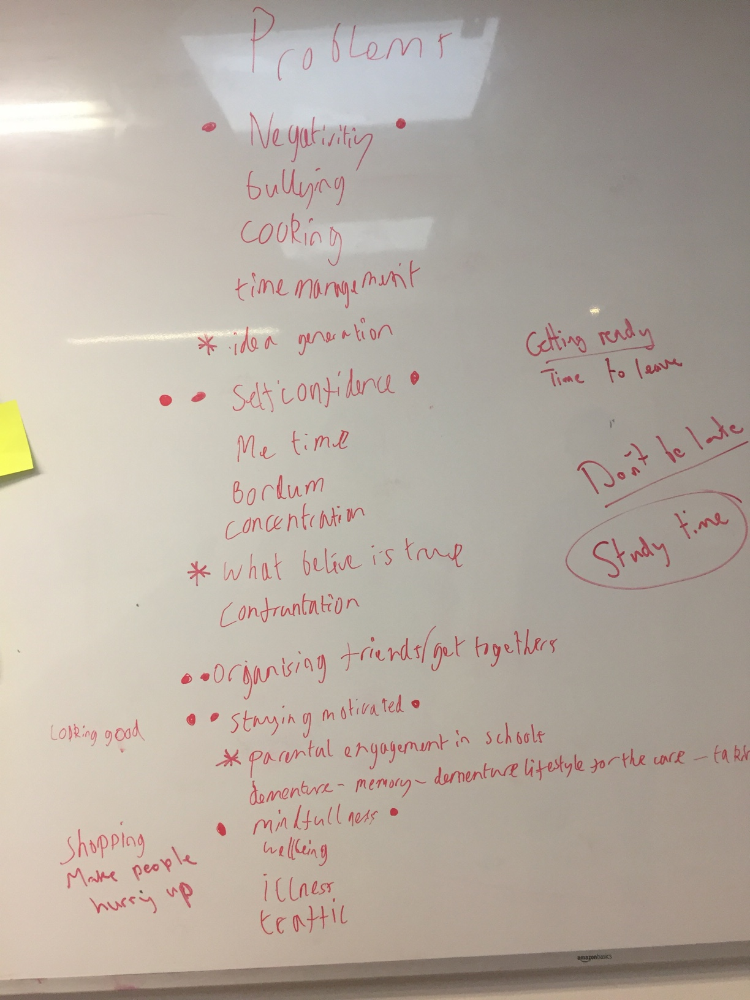
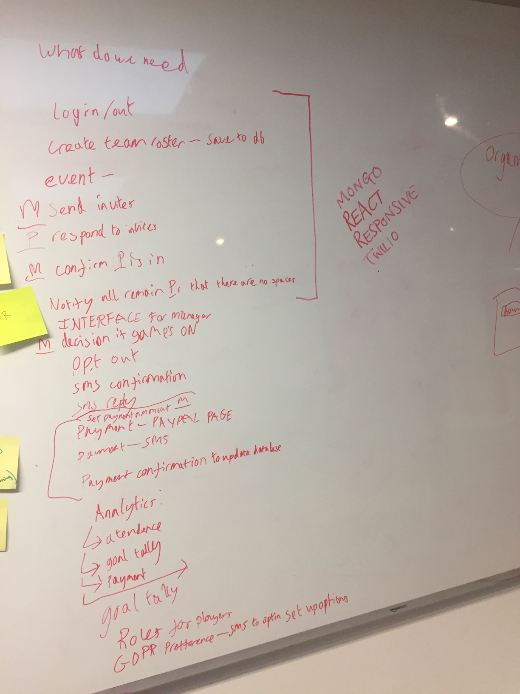
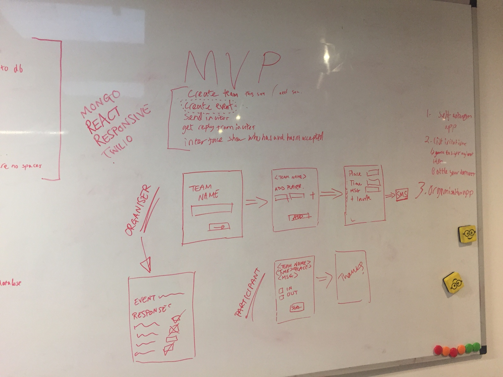
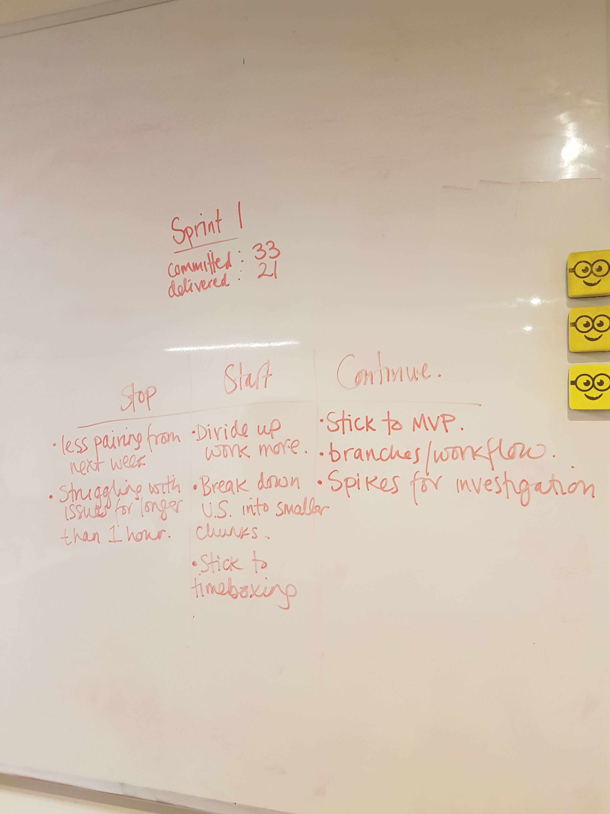

# ImInFinalProject


As a participant I want to reply No to the invitation so that I can attend the event

As a participant I want to receive an invitation so that I can attend the event

As a manager I want to see all participants that are able and not able to attend the event

## Project Description

#### Objective 1:
Our primary objective of this project is to become comfortable with the MERN stack and push ourselves to learn more (Mongo DB, Express, React, Node JS.

#### Objective 2:  
We aimed to build an event management application that allows an Event organiser to Manage events.

#### MVP - Minimum Viable Product
This application allows organisers to create events, add participants and send invitations to those participants. On receiving the invitation the participants can respond if they want to attend or not and this is logged for the organiser to see.

#### Additional
Organisers can set add their payment information via pay pal to take payment from the participants. Once the payment has been processed by us, we then update the status of the participants attendance to 'IN'.

## Set up/ How to install
1. ```cd client```

2. ```npm install ```

3. ``` cd .. ```

4. ```npm run dev ```


## How to run tests
Back end tests ```npm run test:e2e``` in root folder

Front end tests  ```npm run test``` in client folder

## Process
1. We started by brainstorming problems that friends and family had and then looked for solutions to those problems.


2. We narrowed down the solutions to ensure we would be able to use the MERN stack to solve them.


3. We prepared a backlog of work broken down into EPIC's.

4. We then broke those EPIC's down even further into User stories.

5. We prioritised these User stories based on the benefit they would have for the end users

6. We effort scored these user stores

7. We then selected what would suffice for a Minimum Viable Product and put this into our Sprint Backlog


8. We decided to have 2 day sprints and worked through the user stories.

9. During the sprint we had daily stand ups to ensure we were all on the right track. In these stand ups we would say what we are doing, what we have done and if we had any blockers. Our stand ups would be no longer than 15 minutes.

10. At the end of sprint we would have a retrospective that would allow us to state what we did well, what we could improve and what we should continue doing.

11. After retrospective we would gather Feedback from potential users to understand what we should bring into our following sprint.


## Learning Process
